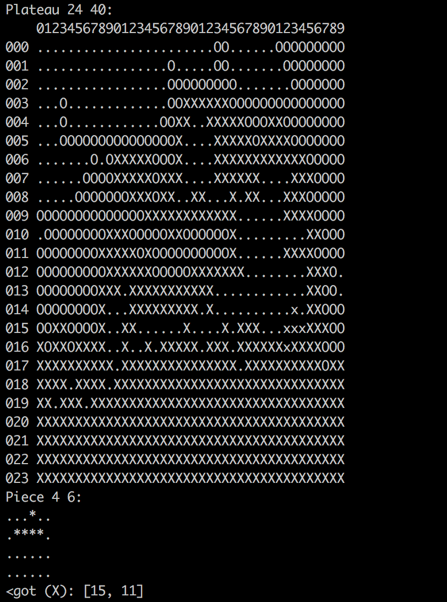
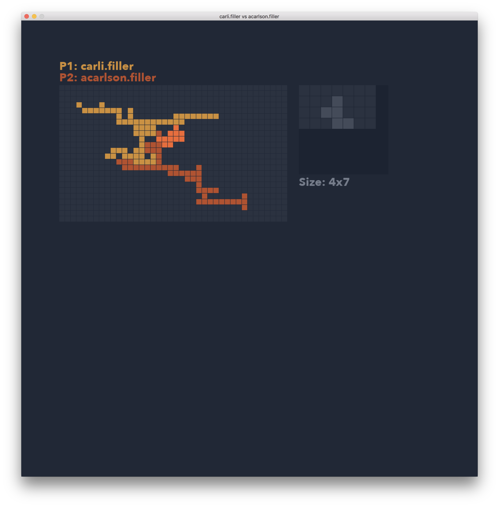
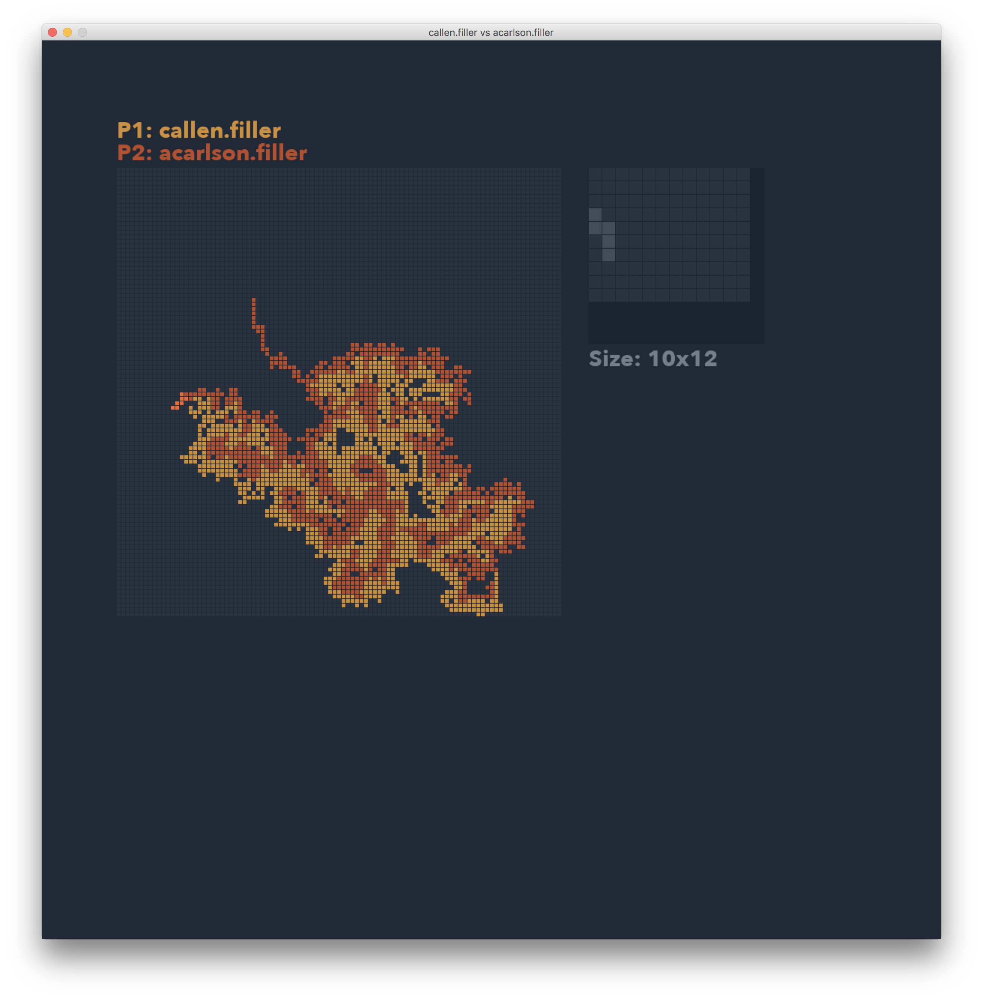

# filler

42 filler project

Developed for macOS High Sierra using clang-902.0.39.1

## Installation

```bash
make
```

This will result in a \*.filler file which can be run in the vm

## filler\_vm

Built with ruby

Maps and precompiled players are in resources/players and resources/maps respectively

Players may not work properly on systems not running macOS High Sierra

### Usage:

```bash
cd resources
./filler_vm -f maps/map00 -p1 players/abanlin.filler -p2 players/hcao.filler
```



## Player

Player reads from stdin and echoes move to stdout

## Visualizer

Built with python3

visu.py reads from stdin and opens a window in which to step through the game

### Dependencies:

* [pygame](https://www.pygame.org/news)

### Usage:

```bash
./filler\_vm -f maps/map00 -p1 players/abanlin.filler -p2 players/hcao.filler | ../visu.py
```

### Navigation:

* right: move game forward

* left: move game backward

* up or +: increment number of steps taken per keypress

* down or -: decrement number of steps taken per keypress

* r: reset steps

* home: go to beginning of game

* end: go to end of game

* Type a number and press enter to set the current pace to n moves per key press




