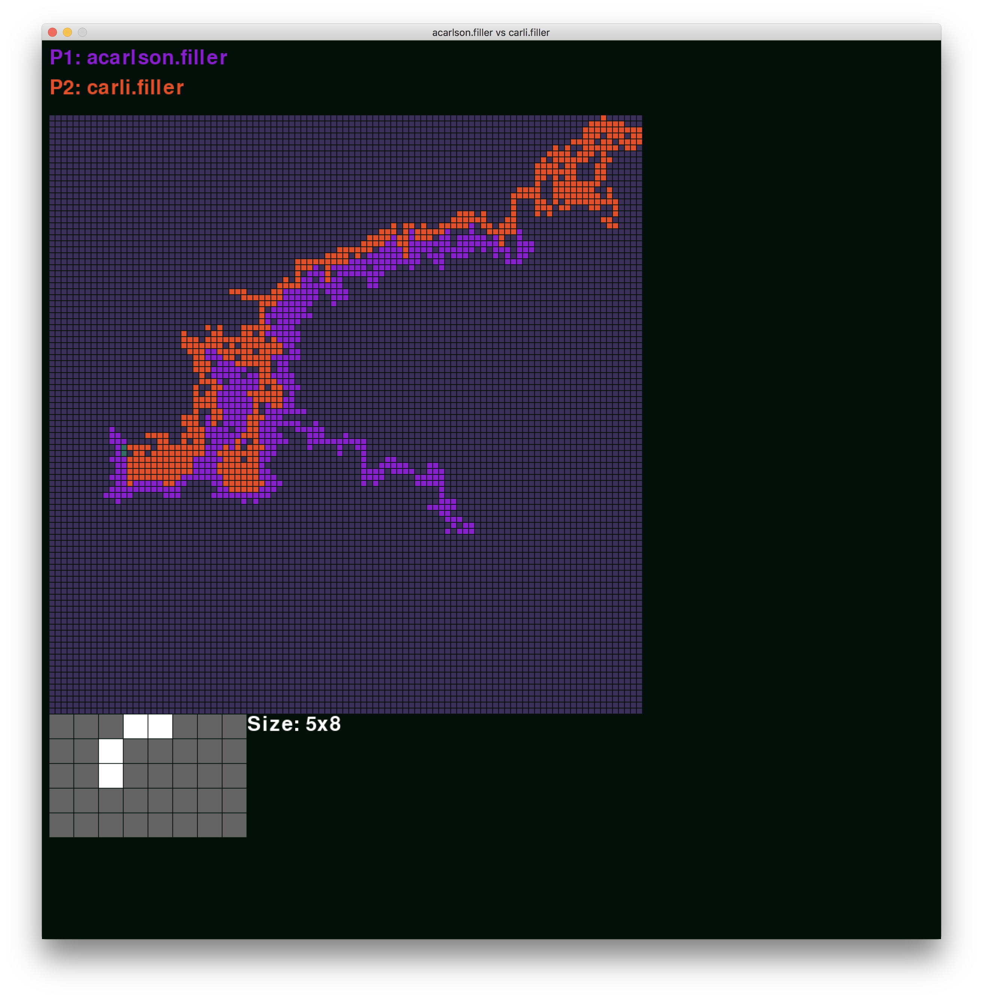

# filler

42 filler project

## Installation

```bash
make
```

This will result in a .filler file which can be run in the vm

## filler_vm

Built with ruby

```bash
cd resources
./filler_vm -f maps/map01 -p1 players/abanlin.filler -p2 players/hcao.filler
```

## Player

Player reads from stdin and echoes move to stdout

## Visualizer



Built with python3

Dependencies:
* [pygame](https://www.pygame.org/news)

visu.py reads from stdin and opens a window in which to step through the game

right: move game forward

left: move game backward

up or +: increment number of steps taken per keypress

down or -: decrement number of steps taken per keypress

r: reset steps

home: go to beginning of game

end: go to end of game

Type a number and press enter to set the current pace to n moves per key press
